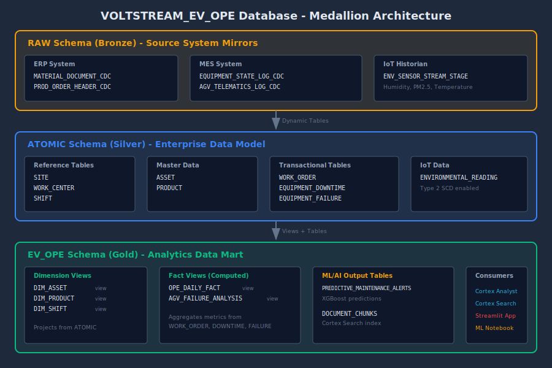
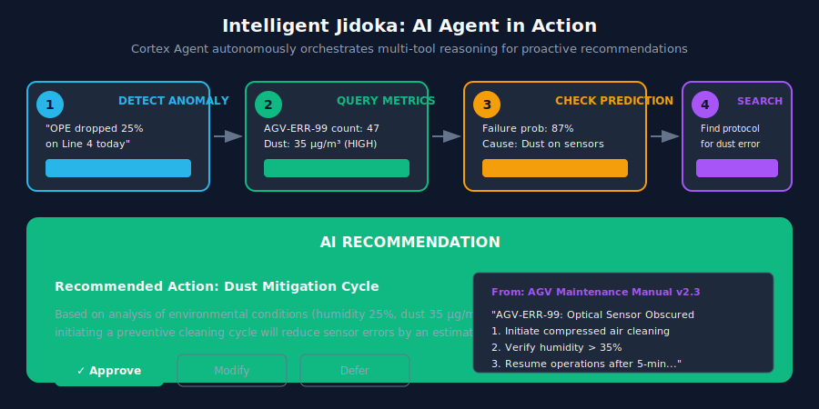
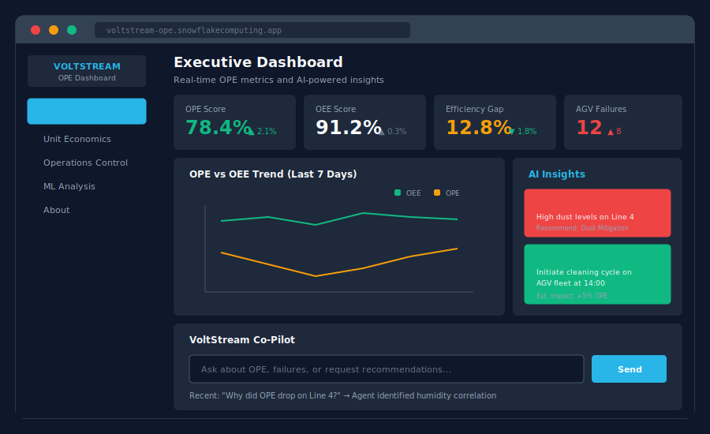

# VoltStream OPE for EV Manufacturing: Achieve 15% Higher Process Efficiency with Snowflake

In high-volume EV Gigafactories, hidden efficiency losses lurk between production steps—where disconnected silos create a "Ghost Inventory" paradox that drains millions while traditional metrics show green.

---

## The Cost of Inaction


**February 2023: A Major EV Manufacturer's $47M Production Loss**

A leading EV manufacturer's Gigafactory experienced a three-day production halt when AGV sensor failures cascaded across multiple assembly lines. Root cause analysis took 72 hours—identifying that low humidity had caused dust accumulation on optical sensors. The failure cost $47M in delayed shipments and emergency repairs.

This was preventable. Environmental data existed in IoT systems, failure patterns were visible in MES logs, and remediation steps were documented in maintenance manuals. But these data sources lived in disconnected silos, invisible to decision-makers until the damage was done.

---

## The Problem in Context

- **Ghost Inventory Paradox.** ERP systems report 90%+ equipment availability while shop floor IoT sensors show production lines starving for materials. This disconnect costs 20-30% of theoretical capacity.

- **Siloed Data, Delayed Decisions.** Environmental sensors, MES equipment logs, and ERP inventory live in separate systems. Correlating a humidity spike to an AGV error to a production stall requires 4+ hours of manual analysis.

- **Reactive Maintenance Culture.** Teams respond to failures after they cascade, not before. By the time AGV-ERR-99 ("Optical Sensor Obscured") appears, the line is already starving for materials.

- **Hidden Root Causes.** Traditional OEE metrics focus on equipment—ignoring the process efficiency losses from wait times, material flow, and logistics failures that occur between machines.

- **Knowledge Trapped in Documents.** Maintenance manuals, shift reports, and troubleshooting guides exist in PDFs and email threads—invisible to real-time decision support systems.

---

## The Transformation


This solution transforms manufacturing operations from reactive firefighting to proactive, AI-driven Jidoka—automation with human intelligence. Instead of spending hours correlating data across systems, operators receive AI-generated insights and recommended actions in minutes.

---

## What We'll Achieve

- **Increase Overall Process Efficiency (OPE) by 15%.** Bridge the gap between theoretical capacity and actual throughput by capturing losses that OEE misses.

- **Reduce Material Starvation Downtime by 20%.** Optimize internal logistics (AGV routing) to match production cadence through predictive failure detection.

- **Accelerate Root Cause Analysis from 4 Hours to 5 Minutes.** AI correlates structured metrics with unstructured maintenance documentation for instant diagnosis.

- **Enable Proactive Maintenance Recommendations.** Cortex Agent autonomously detects failure patterns and recommends preventive actions before production stops.

---

## Business Value


| Metric | Improvement | Business Impact |
|--------|-------------|-----------------|
| **Time to Decision** | 4 hours → 5 minutes | 98% faster root cause analysis |
| **OPE Improvement** | +15% | Recover hidden production capacity |
| **Starvation Reduction** | -20% | Fewer line stoppages from AGV failures |
| **Throughput Recovery** | $42,500/hour | Real-time financial impact visibility |

These outcomes translate to millions in recovered production value annually for a typical Gigafactory operation. The ROI model is built on transparent, auditable calculations tied to actual production metrics.

---

## Why Snowflake

- **Unified Data Foundation.** Converge IT (ERP/SAP) and OT (MES/Siemens/IoT) data in a single governed platform—eliminating the silos that create Ghost Inventory blindness.

- **Performance That Scales.** Stream minute-level IoT telemetry alongside batch ERP snapshots without capacity planning friction. Dynamic Tables provide incremental, governed transformation.

- **Collaboration Without Compromise.** Share production insights across plants, business units, and partners with governance intact. Semantic models enable self-service analytics for non-technical users.

- **Built-in AI/ML and Applications.** Cortex Analyst answers questions in plain English. Cortex Search retrieves knowledge from maintenance manuals. Cortex Agent orchestrates multi-step diagnosis autonomously. All running near the data, with no data movement.

---

## The Data


### Source Systems

| Source | Data Type | Purpose |
|--------|-----------|---------|
| **SAP ERP** | Production orders, inventory movements | The "plan"—what should happen |
| **Siemens MES** | Equipment states, AGV telematics | The "reality"—what actually happens |
| **IoT Historian** | Environmental readings (humidity, dust, temperature) | The "hidden variables"—root causes |
| **Maintenance Docs** | Manuals, SOPs, shift reports (PDF/text) | The "tribal knowledge"—remediation steps |

### Medallion Architecture

| Layer | Schema | Purpose | Key Objects |
|-------|--------|---------|-------------|
| **Bronze** | `RAW` | Source system mirrors with CDC | 5 CDC tables |
| **Silver** | `ATOMIC` | Enterprise data model with Type 2 SCD | 9 dimension/fact tables |
| **Gold** | `EV_OPE` | Analytics-ready views and ML outputs | 5 views, 2 output tables |

### Data Characteristics

- **Freshness:** Environmental sensors stream at 5-minute intervals; MES events are captured in real-time; ERP snapshots refresh hourly. This cadence enables predictive alerts before failures cascade.

- **Trust:** Type 2 Slowly Changing Dimensions provide full audit history. RBAC controls access by role. Data lineage traces every metric from source to dashboard.

- **Relationships:** Assets connect to work centers and production lines. Work orders link to products and shifts. Environmental readings tie to zones where AGVs operate.

---

## Solution Architecture



The solution implements a Bronze → Silver → Gold medallion architecture within Snowflake:

- **Ingestion Layer:** Snowpipe Streaming captures IoT telemetry; scheduled loads bring ERP/MES data; document parsing populates the knowledge base.

- **Transformation Layer:** Dynamic Tables incrementally transform raw CDC events into enterprise-modeled dimensions and facts with audit columns.

- **Analytics Layer:** Computed views aggregate OPE metrics by line, shift, and date. ML predictions identify high-failure periods before they occur.

- **Intelligence Layer:** Cortex Analyst enables natural language queries over production metrics. Cortex Search provides RAG over maintenance documentation. Cortex Agent orchestrates multi-tool reasoning.

- **Application Layer:** Streamlit in Snowflake delivers interactive dashboards for executives, plant managers, and data scientists—each seeing the appropriate depth for their role.

---

## How It Comes Together

1. **Ingest Multi-Source Data.** Stream IoT telemetry, load ERP/MES snapshots, and parse maintenance documents into Snowflake's unified platform. → [sql/02_raw_schema.sql](../sql/02_raw_schema.sql)

2. **Transform to Enterprise Model.** Dynamic Tables harmonize source data into governed dimensions and facts with Type 2 history tracking. → [sql/03_atomic_schema.sql](../sql/03_atomic_schema.sql)

3. **Build Analytics Views.** Compute OPE metrics that reveal the hidden efficiency gap between OEE and actual process performance. → [sql/04_ev_ope_schema.sql](../sql/04_ev_ope_schema.sql)

4. **Enable Knowledge Search.** Index maintenance manuals and SOPs for retrieval-augmented generation (RAG) by Cortex Search. → [sql/05_cortex_search.sql](../sql/05_cortex_search.sql)

5. **Train Predictive Models.** XGBoost classifier identifies environmental conditions that predict AGV failures, enabling proactive maintenance. → [notebooks/agv_failure_prediction.ipynb](../notebooks/agv_failure_prediction.ipynb)

6. **Deploy Intelligent Dashboard.** Streamlit application provides role-based views with embedded Cortex Agent for natural language interaction. → [streamlit/streamlit_app.py](../streamlit/streamlit_app.py)

---

## Key Visualizations

### The OEE vs OPE Gap

The Executive Dashboard reveals what traditional metrics hide. A factory showing 90%+ OEE might be running at only 65% OPE when material flow losses are included.


This "efficiency gap" visualization quantifies the hidden factory—the lost production capacity that exists between machines, in queues, and during logistics delays.

### Environmental Correlation Analysis

The ML Analysis page demonstrates the causal chain: Low Humidity → High Dust → Sensor Errors → Material Starvation → OPE Drop.


Feature importance analysis proves that environmental factors are the leading predictors of AGV failures—insights that were invisible when data lived in silos.

### The Jidoka Moment

The Operations Control page shows the AI Agent in action: detecting an anomaly, correlating structured and unstructured data, and recommending a "Dust Mitigation Cycle" before the line stops.



This is true Jidoka—automation with human intelligence—where the AI proposes and the human approves.

---

## Dashboard Preview



The VoltStream OPE Dashboard provides:

- **Executive Dashboard:** Strategic KPIs showing OEE vs OPE gap analysis with AI-powered root cause insights
- **Unit Economics:** Real-time throughput dollar calculations tied to production line performance
- **Operations Control:** Actionable alerts, AGV fleet status, and SOP lookups via Cortex Search
- **ML Analysis:** Feature importance visualization, model performance metrics, and raw data exploration
- **About:** Dual-audience documentation for business and technical users

---

## Call to Action

### Deploy the Solution

Run the deployment script to set up the complete solution in your Snowflake account:

```bash
# Clone the repository
git clone https://github.com/Snowflake-Labs/snowcore_voltstream_ev_ope.git
cd snowcore_voltstream_ev_ope

# Deploy infrastructure and data
./deploy.sh

# Launch the Streamlit application
./run.sh
```

### Customize for Your Factory

Adapt the solution to your specific manufacturing environment:

- **Replace sample data** with your actual ERP, MES, and IoT sources
- **Extend the semantic model** with your specific metrics and dimensions
- **Add maintenance documents** to the Cortex Search knowledge base
- **Train models** on your historical failure patterns

---

*Transform your Gigafactory from reactive firefighting to proactive Jidoka—where AI-driven insights prevent failures before they cascade, and every operator has the intelligence of a master troubleshooter.*

